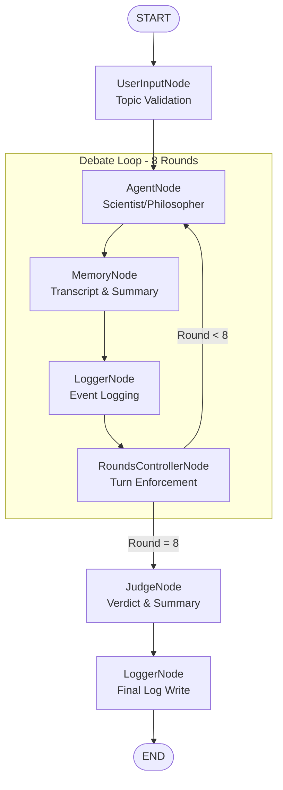

# Multi-Agent Debate System (LangGraph)


An autonomous, structured debate platform where two AI agents (Scientist & Philosopher) engage in a rigorous dialectic, managed by a state-aware control system and evaluated by an impartial AI judge.

This project implements a **Cyclic Directed Acyclic Graph (DAG)** using **LangGraph** to enforce strict debate rules, turn alternation, and argument coherence.




---

## 🏗️ Architecture & Design

The core of this system is a stateful graph application that manages the flow of information between independent functional nodes. Unlike simple linear chains, this system uses a cyclic graph to enable iterative rounds of debate.

### 1. The LangGraph Workflow
The debate logic is modeled as a state machine:

- **State Schema (`DebateState`)**: A shared `TypedDict` that persists across the graph, tracking the `topic`, `current_round`, `turns` (transcript), and `summary`.
- **Cyclic Execution**: The graph cycles between `AgentNode` and `RoundsController` for exactly 8 rounds before exiting to the `JudgeNode`.
- **Conditional Edges**: Logic in the `RoundsController` dynamically routes the workflow:
    - *Round < 8* → Continue to `AgentNode`
    - *Round = 8* → Terminate and route to `JudgeNode`

### 2. Node Implementation

| Node | Responsibility | Implementation Details |
|------|----------------|------------------------|
| **UserInputNode** | Topic Injection | Validates input length (10-500 chars) and sanitizes content before initializing the state. |
| **AgentNode** | Argument Generation | Uses persona templates (Scientist/Philosopher). Retrieves *agent-specific memory slices* (opponent's last point + running summary) to context-window the LLM. |
| **MemoryNode** | State Persistence | Appends new arguments to the `turns` list and updates the running `summary` using an LLM to prevent context overflow. |
| **RoundsController** | Logic & Rules | Enforces strict turn alternation (Scientist=Odd, Philosopher=Even). Detects duplicate arguments using strict string similarity checks. |
| **JudgeNode** | Verdict Engine | Aggregates the full transcript after Round 8. Uses a chain-of-thought prompt to analyze reasoning, declare a winner, and write a justification. |
| **LoggerNode** | Observability | Captures every state transition and node output, appending it to a structured JSON log file for post-mortem analysis. |

---

## ⚙️ Key Technical Features

### 📡 LLM Independence
The system is built on **LangChain**, allowing it to be provider-agnostic. It currently supports:
- **Groq** (Llama 8B/70B) - *Primary (Fast & Free)*
- **OpenAI** (GPT-4o) - *High Reasoning*
- **Google** (Gemini) - *Cost Eficient*

Configuration is handled via `config.yaml`, allowing seamless switching between providers without code changes.

### 🧠 Semantic Memory & Context
To prevent the agents from hallucinating or losing track, we implemented a specific memory strategy:
- **Raw Transcript**: Stored in JSON format for the Judge.
- **Summary Buffer**: A running summary serves as long-term memory for agents, while the immediate previous turns serve as short-term memory.

### 🛡️ Robust Validation
- **Duplicate Detection**: Uses `difflib.SequenceMatcher` to calculate similarity ratios between the new argument and previous turns. Threshold is configurable (default 0.85).
- **Topic Drift**: Keywords from the argument are checked against the topic to ensure agents stay focused.

---

## 📂 Project Structure

```bash
Assignment1/
├── nodes/                  # Core Logic Modules
│   ├── agent_node.py       # LLM Agent wrapper
│   ├── round_controller.py # Rule enforcement logic
│   ├── memory_node.py      # State management
│   └── judge_node.py       # Evaluator logic
├── run_debate.py           # Main CLI Entrypoint
├── config.yaml             # System Configuration
├── dag.md                  # Workflow Diagram
└── tests/                  # Unit Tests (46 passed)
```

---

## 🚀 How to Run

### Prerequisites
- Python 3.10+
- Groq, OpenAI, or Google API Key

### Setup
1. **Clone & Install**:
   ```bash
   pip install -r requirements.txt
   ```
2. **Configure Environment**:
   ```bash
   # Add your API key (GROQ_API_KEY / OPENAI_API_KEY)
   cp .env.example .env
   ```
3. **Run a Debate**:
   ```bash
   python run_debate.py --topic "Should AI be regulated like medicine?"
   ```

### Visualize the Graph
To generate the DAG diagram shown above:
```bash
python generate_dag.py
```

---

## ✅ Verification & Testing

The system is verified by 46 unit tests covering:
- Turn order enforcement (Scientist starts, strict alternation)
- Duplicate argument rejection
- Memory updates and summary generation
- JSON log integrity
- Judge output parsing

Run tests with: `pytest tests/ -v`
