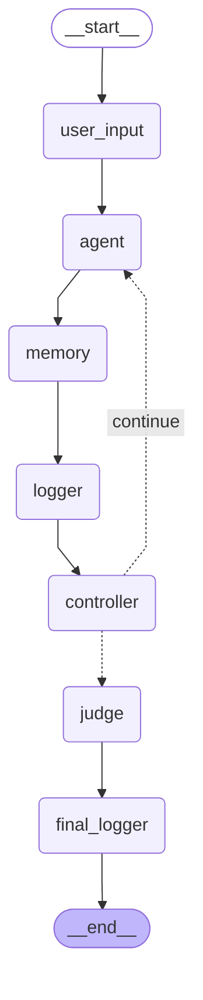

```mermaid
---
config:
  flowchart:
    curve: linear
---
graph TD;
	__start__([<p>__start__</p>]):::first
	user_input(user_input)
	agent(agent)
	memory(memory)
	logger(logger)
	controller(controller)
	judge(judge)
	final_logger(final_logger)
	__end__([<p>__end__</p>]):::last
	__start__ --> user_input;
	agent --> memory;
	controller -. &nbsp;continue&nbsp; .-> agent;
	controller -.-> judge;
	judge --> final_logger;
	logger --> controller;
	memory --> logger;
	user_input --> agent;
	final_logger --> __end__;
	classDef default fill:#f2f0ff,line-height:1.2
	classDef first fill-opacity:0
	classDef last fill:#bfb6fc

```